# 🎨 Text-to-SQL 系统架构流程图

## 📊 系统总体架构图

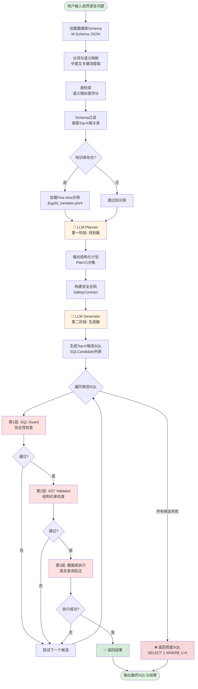

---

## 🔍 详细模块分解

### 1️⃣ Schema检索与预处理

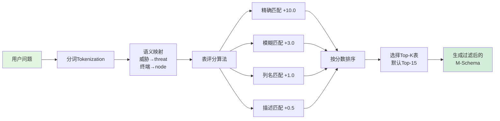

### 2️⃣ 知识库检索（Few-shot）

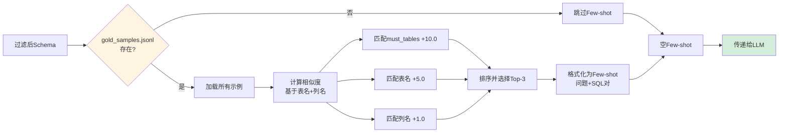

### 3️⃣ LLM Planner - 第一阶段

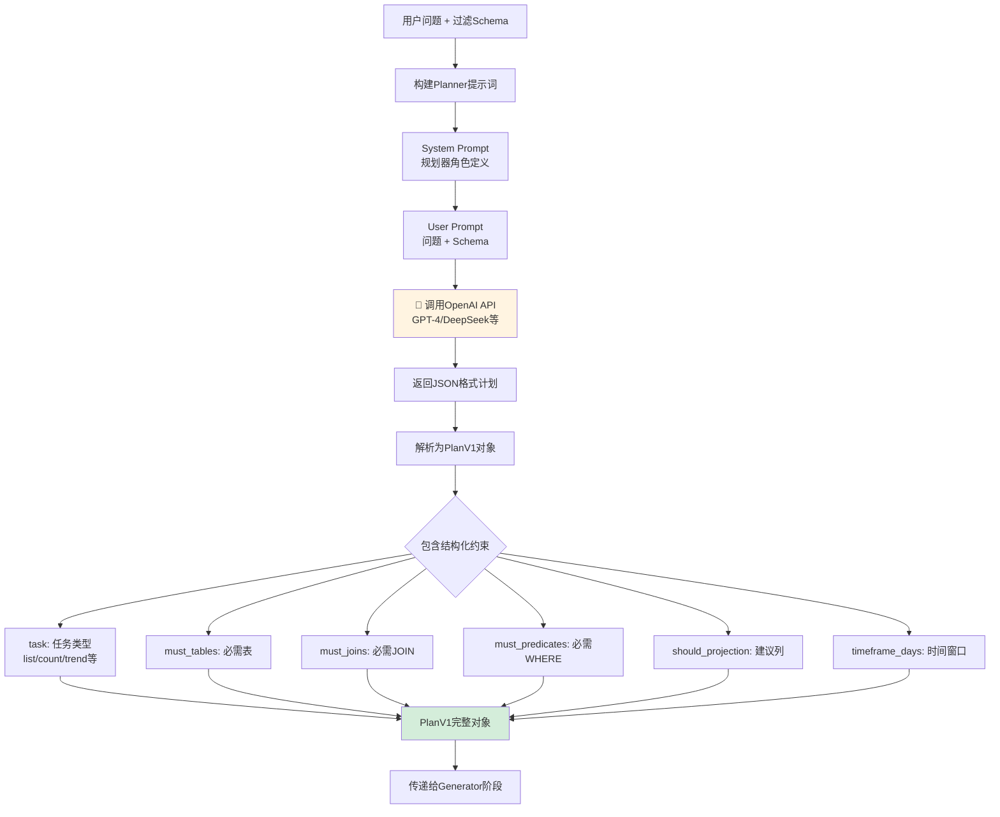

### 4️⃣ 安全合同构建

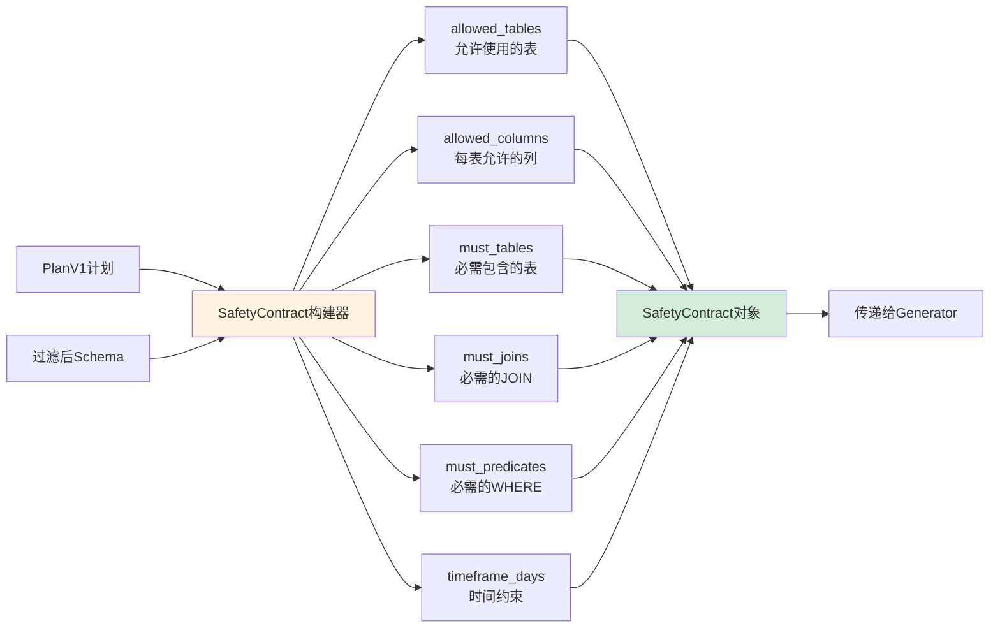

### 5️⃣ LLM Generator - 第二阶段

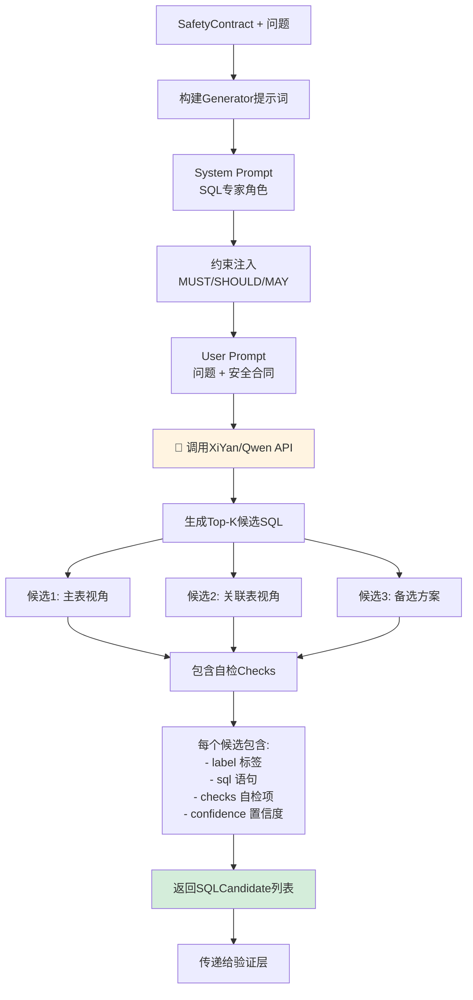

### 6️⃣ 三层验证流水线

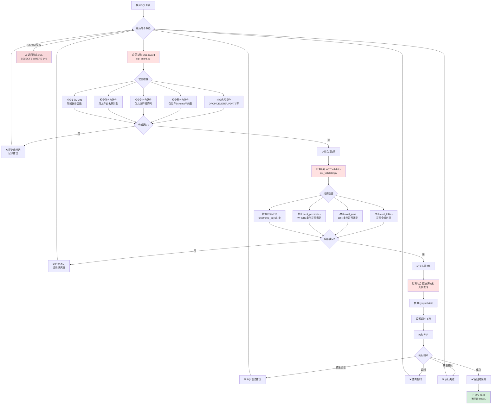

---

## 🔄 完整端到端流程时序图

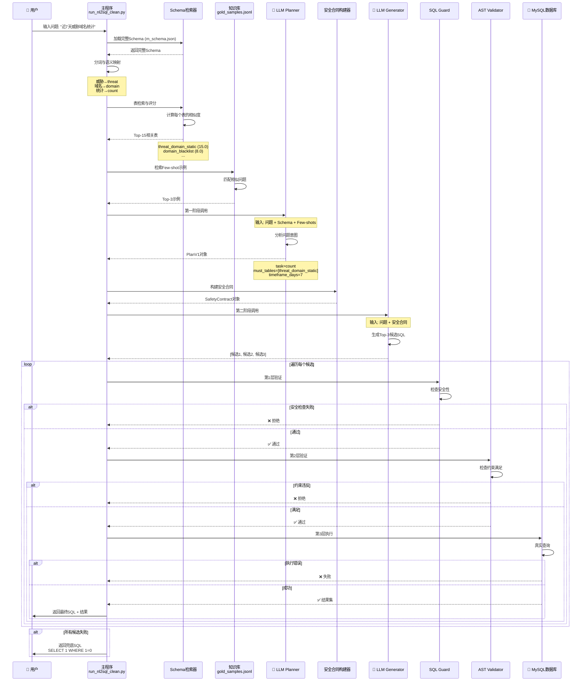

---

## 🎯 核心文件职责地图

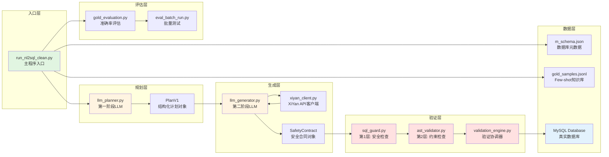

---

## 🔒 三层验证详解

### 第1层: SQL Guard (安全性)

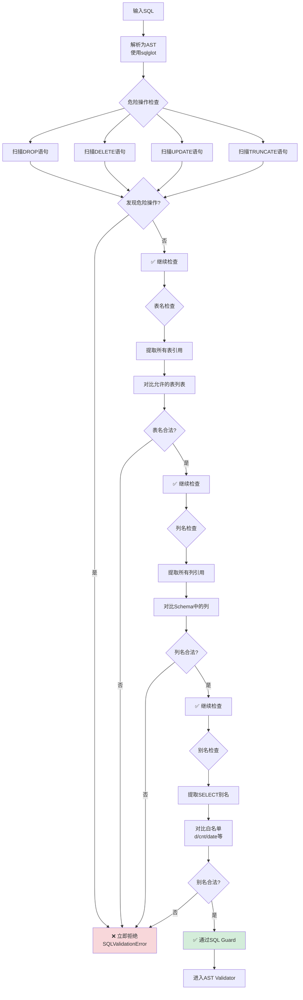

### 第2层: AST Validator (约束满足)

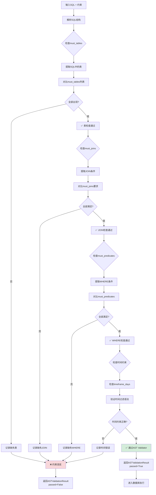

### 第3层: 数据库执行 (真实性)

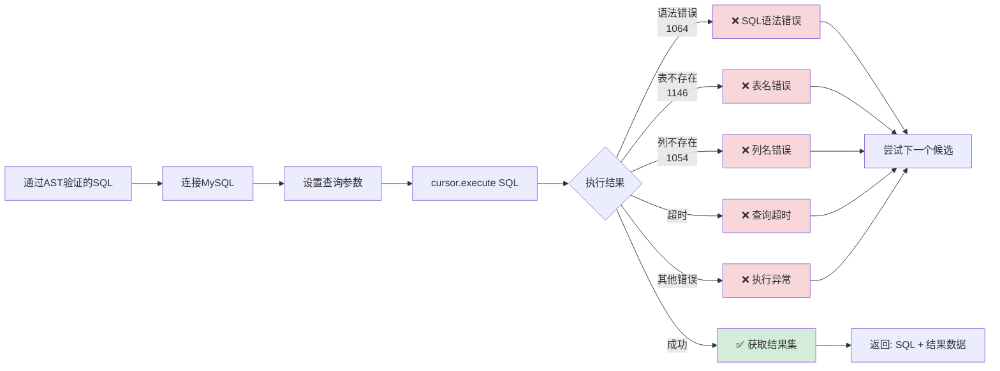

---

## 📈 性能与扩展性

### 并发执行策略

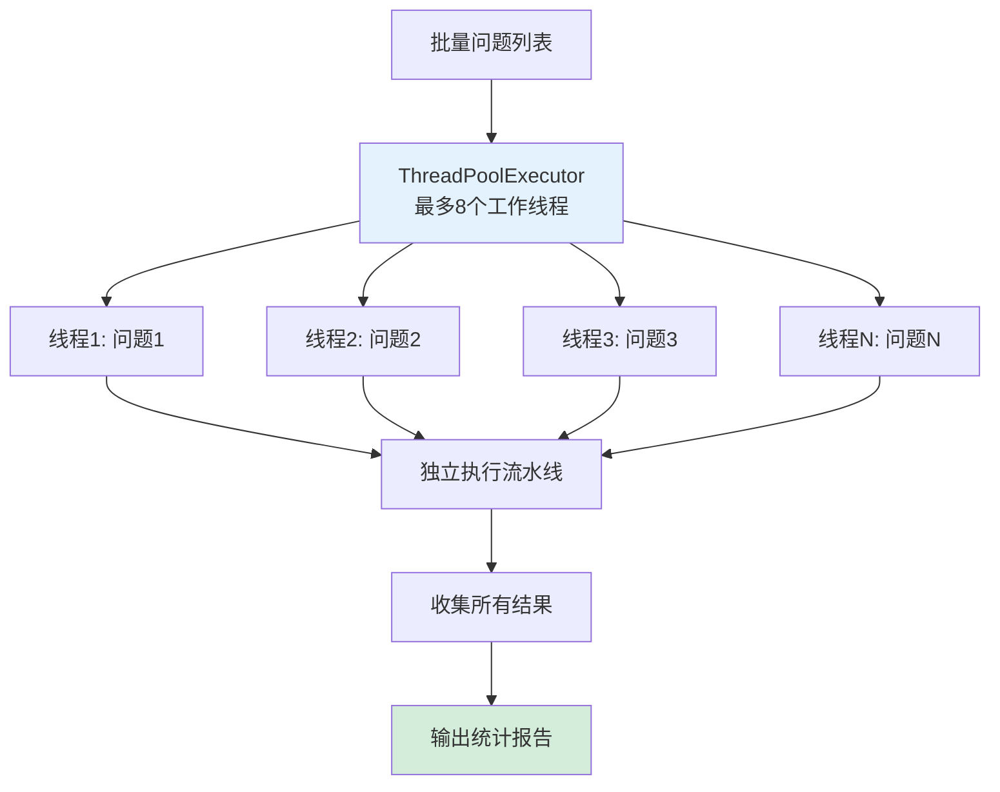

---

## 🎓 使用示例流程

```mermaid
graph LR
    A[用户问题:<br/>"近7天威胁域名统计"] --> B[Schema检索]
    B --> C[选中:<br/>threat_domain_static]
    C --> D[Planner规划:<br/>task=count<br/>timeframe_days=7]
    D --> E[Generator生成SQL]
    E --> F[候选SQL:<br/>SELECT domain_address, COUNT*<br/>FROM threat_domain_static<br/>WHERE first_find_time >= ...]
    F --> G[三层验证]
    G --> H[数据库执行]
    H --> I[返回结果:<br/>domain1: 150<br/>domain2: 89<br/>...]
    
    style A fill:#e1f5e1
    style I fill:#d4edda
```

---

## 📝 评估流程

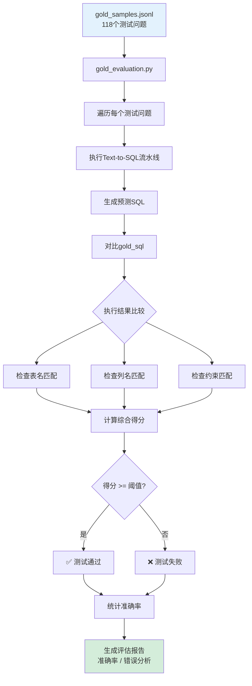

---

## 🔧 配置与环境

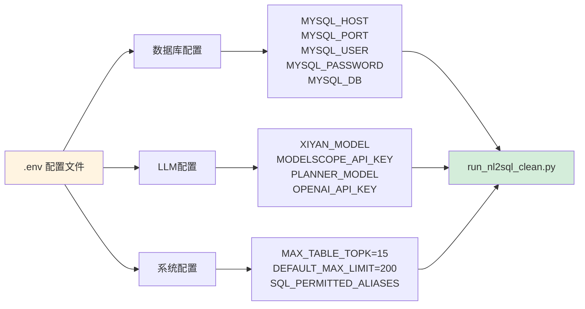

---

## 🎯 关键技术特性

### 两阶段LLM架构

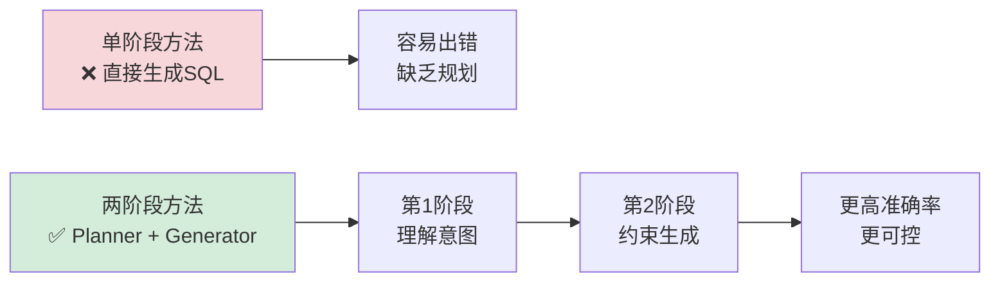

### 分层约束系统

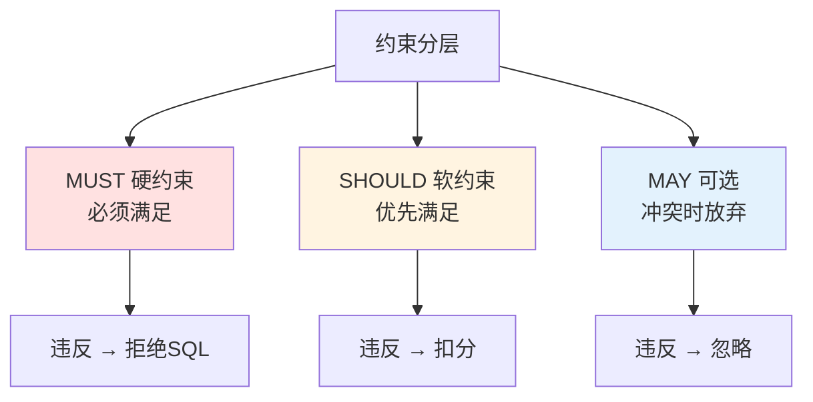

---

**🎉 流程图完成！**

这些流程图展示了项目的完整工作流程，包括：
- 总体架构
- 详细模块分解
- 时序交互
- 验证流程
- 评估机制

可以直接在GitHub上查看这些Mermaid图表！

