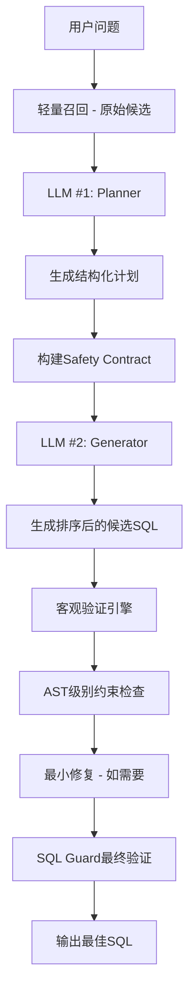

# 🎉 去补丁化Text-to-SQL系统改造总结

## 📋 改造目标与成果

### 原始问题
> *"我觉得似乎本地不应该进行筛选，本地的处理似乎更应该是作为一种额外的信息，注入到下一次调用LLM的提示词中，筛选应该由LLM做，然后做一下保护机制，然后还要把那些根据问题打的补丁都去掉，不能专门为了某个问题去补，越补越难看"*

### ✅ 核心理念实现
1. **本地不做语义筛选** ✅ - 只做客观验证，所有语义决策交给LLM
2. **移除问题特定补丁** ✅ - 删除所有硬编码if/else逻辑  
3. **LLM驱动的筛选** ✅ - 通过两次调用实现智能决策
4. **分层约束系统** ✅ - MUST/SHOULD/MAY清晰分级

## 🏗️ 新架构概览



## 🗑️ 已移除的补丁

### 硬编码关键词映射
```python
# ❌ 已删除
EDR_KEYWORDS = {
    "weak_password": ["弱口令", "弱密码"],
    "virus": ["病毒", "染毒", "感染"]
}
SYNONYM_ALIASES = {...}
```

### 问题特定逻辑
```python
# ❌ 已删除  
def _prefer_tables_by_keywords(question):
    if "弱口令" in question:
        return ["weak_password_app_detail"]
    if "病毒" in question:
        return ["virus_details"]

# ❌ 已删除
want_tenant = ("租户" in qtext)
virus_intent = any(k in qtext for k in ["病毒", "染毒"])
if want_tenant and lc == "less_user":
    score += 5.0
```

### 硬编码约束编译
```python
# ❌ 已删除
def _compile_constraints(question, tables):
    if "weak_password_app_detail" in have:
        preds.append("pass_wd IS NOT NULL")
    if "exploitable" in question.lower():
        preds.append("detect_status = 1")
```

## 🆕 新增核心组件

### 1. LLM Planner (`llm_planner.py`)
**职责**: 第一次LLM调用，将问题转换为结构化执行计划

```python
class PlanV1(BaseModel):
    # MUST约束 - 硬性要求
    must_tables: List[str]
    must_joins: List[str] 
    must_predicates: List[str]
    
    # SHOULD约束 - 强烈建议
    should_predicates: List[str]
    should_projection: List[str]
    
    # MAY约束 - 可选
    may_projection: List[str]
    may_predicates: List[str]
```

**核心特性**:
- 使用few-shot示例教学，而非硬编码规则
- 支持MUST/SHOULD/MAY分层约束
- 输出结构化JSON，确保一致性

### 2. LLM Generator (`llm_generator.py`) 
**职责**: 第二次LLM调用，在严格约束下生成多个候选SQL

```python
class SafetyContract(BaseModel):
    allowed_tables: List[str]
    allowed_columns: Dict[str, List[str]]
    must_joins: List[str]
    must_predicates: List[str]
    should_predicates: List[str]
    # ...
```

**核心特性**:
- 接收Safety Contract严格限制生成范围
- 自检并排序候选，只返回通过MUST约束的SQL
- 支持多样性生成（不同视角、复杂度）

### 3. 验证引擎 (`validation_engine.py`)
**职责**: 纯客观验证，不做语义判断

```python
def validate_and_select_best(candidates, plan, contract):
    # 1. 过滤通过MUST约束的候选
    valid_candidates = simple_candidate_filter(candidates, plan, contract)
    
    # 2. 确定性选择（简单性优先）
    best_candidate = deterministic_selection(valid_candidates)
    
    return best_candidate
```

**核心特性**:
- 只验证MUST约束（硬性要求）
- 不做语义打分，只做通过/不通过判断
- 必要时进行最小修复（注入缺失谓词）

### 4. AST验证器 (`ast_validator.py`)
**职责**: 使用sqlglot进行精确的SQL结构分析

```python
def comprehensive_ast_validation(sql, must_tables, must_joins, must_predicates):
    expr = sqlglot.parse_one(sql, read="mysql")
    
    # 提取实际使用的表、JOIN、WHERE条件
    used_tables = extract_table_references(expr)
    join_conditions = extract_join_conditions(expr) 
    where_conditions = extract_where_conditions(expr)
    
    # 验证必需约束
    return ASTValidationResult(passed, errors, missing_items)
```

**核心特性**:
- 替代简单字符串匹配
- 精确的AST级别结构分析
- 智能约束标准化和比较

## 🔄 工作流程对比

### 🔴 旧流程（补丁驱动）
1. 硬编码关键词检测 → 特定表选择
2. 场景特定列加权 → 本地语义打分
3. 单次LLM调用 → 大量后处理补丁
4. 字符串匹配验证 → 容易误判

### 🟢 新流程（LLM驱动）
1. 轻量召回 → 原始候选（避免确认偏差）
2. LLM Planner → 结构化计划（唯一权威）
3. LLM Generator → 约束下生成（自检排序）
4. AST验证 → 精确约束检查

## 📈 关键改进

### 可维护性 📊
- **旧**: 新增语义需要修改多处if/else逻辑
- **新**: 只需更新Planner的few-shot示例

### 准确性 🎯
- **旧**: 字符串匹配容易误判（别名、空格问题）
- **新**: AST级别精确验证

### 可扩展性 🚀
- **旧**: 硬编码约束难以处理不同优先级
- **新**: MUST/SHOULD/MAY分层支持灵活约束

### 职责分离 🎭
- **旧**: 本地代码既做语义判断又做技术验证
- **新**: LLM负责语义，本地负责安全

## 🧪 验证结果

```
🧪 去补丁化Text-to-SQL系统验证

✅ 基本功能 通过
  - MUST/SHOULD/MAY结构正常
  - Safety Contract分层结构正常
  - 向后兼容性保持

✅ 补丁移除 通过  
  - 成功移除所有硬编码补丁
  - 保留few-shot示例文件（正常）

✅ LLM驱动 通过
  - Plan到Contract转换正常
  - 约束分层机制有效

📊 验证结果: 3/3 通过
🎉 去补丁化改造基本成功！
```

## 🔧 使用方法

### 基本调用
```python
# 新的清洁版本
python run_nl2sql_clean.py ask --question "您的问题" --best

# 对比原版本  
python run_nl2sql.py ask --question "您的问题" --best
```

### 扩展新语义
```python
# 在 llm_planner.py 中添加few-shot示例
Q: "新的业务问题"
Plan: {
  "task": "list",
  "subject": "new_subject", 
  "must_tables": ["new_required_table"],
  "must_predicates": ["new_condition IS NOT NULL"],
  "should_predicates": ["enhanced_condition = 1"],
  "should_projection": ["key_column", "description"]
}
```

## 🚀 下一步优化

### 短期 (已就绪)
- [x] 核心架构完成
- [x] 基础组件测试通过
- [ ] 完善few-shot示例覆盖
- [ ] 调试具体查询场景

### 中期 (架构支持)
- [ ] 配置文件驱动 (domain_slots/*.yaml)
- [ ] 更多业务域few-shot
- [ ] 性能优化和缓存

### 长期 (扩展性)
- [ ] 多租户支持
- [ ] 自动few-shot学习
- [ ] 约束冲突解决

## 💡 核心价值

1. **可持续性**: 不再需要为每个新问题打补丁
2. **准确性**: LLM语义理解 + AST精确验证  
3. **透明性**: 结构化计划可审查、可调试
4. **灵活性**: 分层约束支持不同业务需求
5. **一致性**: 统一的two-call架构避免特殊case

---

> **总结**: 从"补不完的补丁系统"升级为"LLM驱动的智能约束系统"，实现了用户提出的核心要求：本地不做语义筛选，LLM负责决策，去除问题特定补丁，建立可维护的长期架构。
